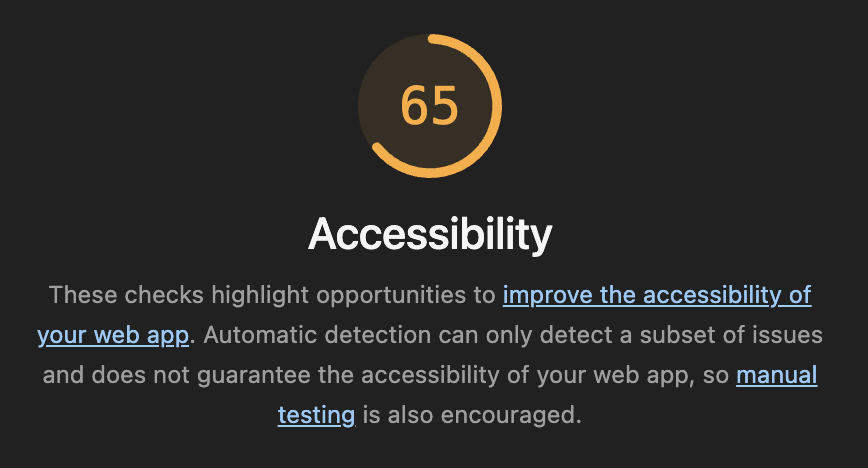

# Q1 : Donner la tailles des fichiers générer par la commande.
Réponse: 108.48 kB

# Q2 : Donner la tailles des fichiers générer par la commande.
Réponse: 68.21 kB

# Q3 : Est-ce que le fichier est lisible ? Quel est l'intêret de minifier les fichiers d'un point de vue éco-responsable ? Pourquoi on ne minifie pas les fichiers générer en mode dev ?
Réponse: Le ficher n'est pas lisible car il est concaténé dans le but de prendre le moins de place possible. Ici le fichier es minifié car il sera déposé dans un serveur et est voué à être stocké plus ou moins durablement.

# Q4 : Donner la tailles des fichiers générer par la commande.
Réponse:
dist/index.html                   0.46 kB │ gzip:  0.30 kB
dist/assets/react-CHdo91hT.svg    4.13 kB │ gzip:  2.05 kB
dist/assets/index-Ck_6z9u0.css    5.65 kB │ gzip:  1.40 kB
dist/assets/index-DjOYzNxq.js   144.35 kB │ gzip: 46.39 kB

# Q5: Quel est l'intérêt du HMR ?
Réponse: mettre à jour l'application en temps réel dans le navigateur sans recharger la page complète, ce qui permet de gagner du temps et de conserver l'état actuel de l'interface pendant le développement

# Q6: Donner la tailles des fichiers générer par la commande. Pourquoi il faut être vigilant sur les libraires et autre composant qu'on ajoute dans nos applications d'un point de vue éco-responsable ?
Réponse:
dist/index.html                   0.46 kB │ gzip:  0.30 kB
dist/assets/react-CHdo91hT.svg    4.13 kB │ gzip:  2.05 kB
dist/assets/index-Ck_6z9u0.css    5.65 kB │ gzip:  1.40 kB
dist/assets/index-CXkX2fal.js   157.22 kB │ gzip: 51.92 kB
✓ built in 1.25s

la librairie allourdi le poids total de l'application

# Q7: Noter les nom des différents fichiers qui ont été générés par la commande.
Réponse: 
dist/about/index.html           0.53 kB │ gzip: 0.32 kB
dist/index.html                 0.65 kB │ gzip: 0.37 kB
dist/assets/style-b4SyXn9O.css  2.18 kB │ gzip: 0.79 kB
dist/assets/about-D08RWGIN.js   0.15 kB │ gzip: 0.16 kB
dist/assets/style-Dgd37vtf.js   0.71 kB │ gzip: 0.40 kB
dist/assets/main-QCVwn2m0.js    3.19 kB │ gzip: 1.13 kB

# Q8 : Noter les nom des différents fichiers .js qui sont chargés au moment du chargement de la page.
Réponse: 
curly-happiness-67x66jwrv5wh59p9-4173.app.github.dev
font-awesome.min.css
main-QCVwn2m0.js
style-Dgd37vtf.js
style-b4SyXn9O.css
questions
Imagequestion.gif
fontawesome-webfont.woff2?v=4.7.0
vite.svg

# Q9 : Noter les nom des différents fichiers .js qui sont chargés au moment du changement de page.
Réponse:
about/
about-D08RWGIN.js
style-Dgd37vtf.js
style-b4SyXn9O.css
vite.svg

# Q10: Quel est l'intérêt de lu Code Splitting d'un point de vue éco-responsable ?
Réponse:
Le Code Splitting est un levier de sobriété numérique car il permet de réduire les transferts, économiser la batterie, lutter contre l'obsolescence, optimiser le cache

# Q11: Ajouter le screen de votre score :
Screen: 

# Q12:  Proposition 1
Description: image svg au lieu de gif
Nb de requête total du parcours de l'utilisateur:
Taille total des requêtes du parcours de l'utilisateur:
Taille total des fichiers généré :

# Q13:  Proposition 2
Description:
Nb de requête total du parcours de l'utilisateur:
Taille total des requêtes du parcours de l'utilisateur:
Taille total des fichiers généré :

# Q14:  Proposition 3
Description:
Nb de requête total du parcours de l'utilisateur:
Taille total des requêtes du parcours de l'utilisateur:
Taille total des fichiers générés :